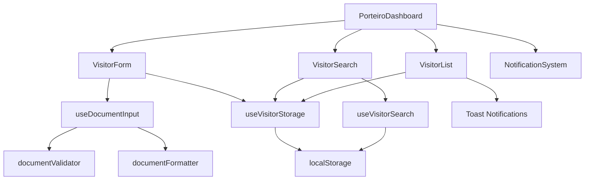

# Design Document - Correções Dashboard do Porteiro

## Overview

Este documento descreve o design técnico para implementar correções e melhorias no Dashboard do Porteiro do SIGECO. As soluções incluem validação inteligente de documentos, componentes de seleção, correção de z-index, funcionalidade de busca, notificações com feedback de tempo, integração WhatsApp, e persistência de dados local.

## Architecture

### Component Structure

```
src/
├── pages/
│   └── PorteiroDashboard.tsx (modificado)
├── components/
│   ├── NotificationSystem.tsx (modificado - z-index fix)
│   └── visitor/
│       ├── VisitorForm.tsx (novo - formulário isolado)
│       ├── VisitorSearch.tsx (novo - busca funcional)
│       └── VisitorList.tsx (novo - lista com check-out)
├── lib/
│   ├── validators/
│   │   ├── documentValidator.ts (novo - validação CPF/RG)
│   │   └── nameValidator.ts (novo - validação de nome)
│   ├── formatters/
│   │   └── documentFormatter.ts (novo - máscaras CPF/RG)
│   └── storage/
│       └── visitorStorage.ts (novo - localStorage)
├── hooks/
│   ├── useDocumentInput.ts (novo - hook para documento)
│   ├── useVisitorStorage.ts (novo - hook para persistência)
│   └── useVisitorSearch.ts (novo - hook para busca)
└── types/
    └── visitor.ts (novo - tipos TypeScript)
```

### Data Flow



## Components and Interfaces

### 1. Document Validation System

#### documentValidator.ts

```typescript
interface DocumentValidation {
  isValid: boolean;
  type: 'CPF' | 'RG' | 'UNKNOWN';
  formatted: string;
  error?: string;
}

// Valida CPF usando algoritmo oficial
function validateCPF(cpf: string): boolean

// Valida RG (formato básico)
function validateRG(rg: string): boolean

// Detecta automaticamente o tipo de documento
function detectDocumentType(value: string): 'CPF' | 'RG' | 'UNKNOWN'

// Função principal de validação
function validateDocument(value: string): DocumentValidation
```

**CPF Validation Algorithm:**
- Remove caracteres não numéricos
- Verifica se tem 11 dígitos
- Calcula primeiro dígito verificador
- Calcula segundo dígito verificador
- Compara com dígitos fornecidos

**RG Validation:**
- Remove caracteres não numéricos
- Verifica se tem 9 dígitos
- Formato básico (RG varia por estado)

#### documentFormatter.ts

```typescript
// Aplica máscara de CPF: 000.000.000-00
function formatCPF(value: string): string

// Aplica máscara de RG: 00.000.000-0
function formatRG(value: string): string

// Formata automaticamente baseado no tipo detectado
function formatDocument(value: string): string

// Remove formatação para validação
function unformatDocument(value: string): string
```

#### useDocumentInput.ts (Custom Hook)

```typescript
interface UseDocumentInputReturn {
  value: string;
  formattedValue: string;
  type: 'CPF' | 'RG' | 'UNKNOWN';
  isValid: boolean;
  error: string | null;
  onChange: (value: string) => void;
  onBlur: () => void;
}

function useDocumentInput(initialValue?: string): UseDocumentInputReturn
```

**Hook Behavior:**
- Detecta tipo de documento em tempo real
- Aplica máscara automaticamente durante digitação
- Valida ao perder foco (onBlur)
- Retorna estado completo para o componente

### 2. Name Validation System

#### nameValidator.ts

```typescript
interface NameValidation {
  isValid: boolean;
  formatted: string;
  error?: string;
}

// Valida se contém apenas letras, espaços e acentos
function validateName(name: string): NameValidation

// Capitaliza primeira letra de cada palavra
function capitalizeName(name: string): string

// Remove espaços extras
function normalizeName(name: string): string
```

**Validation Rules:**
- Aceita: a-z, A-Z, espaços, á é í ó ú ã õ ç
- Rejeita: números, símbolos especiais
- Mínimo: 3 caracteres
- Máximo: 100 caracteres
- Auto-capitalização
- Trim de espaços extras

### 3. Destination Select Component

#### VisitorForm.tsx (Destino Field)

```typescript
interface Destination {
  value: string;
  label: string;
  category: 'apartment' | 'common_area' | 'admin';
}

const destinations: Destination[] = [
  // Apartamentos
  { value: 'apto-101', label: 'Apto 101', category: 'apartment' },
  { value: 'apto-102', label: 'Apto 102', category: 'apartment' },
  // ... até Apto 304
  
  // Áreas comuns
  { value: 'administracao', label: 'Administração', category: 'admin' },
  { value: 'salao-festas', label: 'Salão de Festas', category: 'common_area' },
  { value: 'academia', label: 'Academia', category: 'common_area' },
  { value: 'piscina', label: 'Piscina', category: 'common_area' },
  { value: 'churrasqueira', label: 'Churrasqueira', category: 'common_area' },
]
```

**Component:** shadcn/ui Select with search
- Dropdown com lista de destinos
- Busca/filtro em tempo real
- Agrupamento por categoria
- Obrigatório (required)

### 4. Notification System Z-Index Fix

#### NotificationSystem.tsx (Modified)

**Current Issue:**
```css
/* Atual - z-index: 50 */
className="... z-50"
```

**Solution:**
```css
/* Novo - z-index hierarchy */
.notification-panel {
  z-index: 9999;  /* Acima de tudo */
  position: fixed; /* Garantir posicionamento correto */
}

.notification-overlay {
  z-index: 9998;  /* Backdrop opcional */
}
```

**Z-Index Hierarchy:**
- Base content: z-10
- Dropdowns/Selects: z-40
- Modals/Dialogs: z-50
- Toasts: z-100
- Notifications: z-9999 (highest)

**Additional Fixes:**
- Usar `position: fixed` ao invés de `absolute`
- Adicionar backdrop opcional para fechar ao clicar fora
- Garantir que o portal do Radix UI não interfira

### 5. Visitor Search Functionality

#### useVisitorSearch.ts

```typescript
interface SearchResult {
  visitor: Visitor;
  matchType: 'name' | 'document' | 'destination';
  relevance: number;
}

interface UseVisitorSearchReturn {
  query: string;
  results: SearchResult[];
  isSearching: boolean;
  setQuery: (query: string) => void;
  clearSearch: () => void;
}

function useVisitorSearch(visitors: Visitor[]): UseVisitorSearchReturn
```

**Search Algorithm:**
1. Normaliza query (lowercase, remove acentos)
2. Busca em múltiplos campos:
   - Nome (fuzzy match)
   - Documento (exact match)
   - Destino (partial match)
3. Calcula relevância:
   - Exact match: 100
   - Starts with: 80
   - Contains: 60
4. Ordena por relevância
5. Retorna top 10 resultados

#### VisitorSearch.tsx

```typescript
interface VisitorSearchProps {
  onSelectVisitor: (visitor: Visitor) => void;
}

// Componente com:
// - Input de busca
// - Lista de resultados em tempo real
// - Detalhes do visitante ao clicar
// - Histórico de visitas
```

### 6. Check-out with Duration Toast

#### VisitorList.tsx (Modified)

```typescript
interface CheckoutResult {
  visitor: Visitor;
  duration: {
    hours: number;
    minutes: number;
    totalMinutes: number;
  };
}

function calculateDuration(entryTime: Date, exitTime: Date): Duration

function formatDuration(duration: Duration): string {
  // "Permaneceu 2 horas e 30 minutos"
  // "Permaneceu 45 minutos"
}

function handleCheckout(visitorId: number): void {
  const visitor = findVisitor(visitorId);
  const exitTime = new Date();
  const duration = calculateDuration(visitor.entrada, exitTime);
  
  // Atualiza estado
  updateVisitorStatus(visitorId, 'Saiu', exitTime);
  
  // Exibe toast
  toast({
    title: `Saída de ${visitor.nome} registrada com sucesso`,
    description: formatDuration(duration),
    duration: 5000,
  });
  
  // Salva no localStorage
  saveVisitor(visitor);
}
```

**Duration Calculation:**
```typescript
function calculateDuration(entry: Date, exit: Date) {
  const diffMs = exit.getTime() - entry.getTime();
  const totalMinutes = Math.floor(diffMs / 60000);
  const hours = Math.floor(totalMinutes / 60);
  const minutes = totalMinutes % 60;
  
  return { hours, minutes, totalMinutes };
}
```

**Toast Format:**
- Título: "Saída de [Nome] registrada com sucesso"
- Descrição: "Permaneceu X horas e Y minutos" ou "Permaneceu X minutos"
- Duração: 5 segundos
- Estilo: Success (verde)

### 7. WhatsApp Integration

#### Support Contact Button

```typescript
const SUPPORT_PHONE = '5519997775596';
const SUPPORT_MESSAGE = 'Olá, preciso de suporte técnico com o SIGECO';

function openWhatsAppSupport() {
  const encodedMessage = encodeURIComponent(SUPPORT_MESSAGE);
  const whatsappUrl = `https://wa.me/${SUPPORT_PHONE}?text=${encodedMessage}`;
  
  window.open(whatsappUrl, '_blank', 'noopener,noreferrer');
}

// Componente
<Button onClick={openWhatsAppSupport}>
  <Phone className="h-4 w-4 mr-2" />
  Contatar
</Button>
```

**WhatsApp URL Format:**
- Base: `https://wa.me/`
- Phone: `5519997775596` (com código do país)
- Message: `?text=` + URL encoded message
- Opens in new tab with security attributes

### 8. Local Storage Persistence

#### visitorStorage.ts

```typescript
interface StorageConfig {
  key: string;
  maxRecords: number;
}

const STORAGE_KEY = 'sigeco_visitors';
const MAX_RECORDS = 100;

// Salva visitante
function saveVisitor(visitor: Visitor): void

// Carrega todos os visitantes
function loadVisitors(): Visitor[]

// Atualiza visitante existente
function updateVisitor(id: number, updates: Partial<Visitor>): void

// Remove visitantes antigos (mantém últimos 100)
function pruneOldRecords(): void

// Limpa todos os dados
function clearStorage(): void
```

#### useVisitorStorage.ts

```typescript
interface UseVisitorStorageReturn {
  visitors: Visitor[];
  addVisitor: (visitor: Omit<Visitor, 'id'>) => void;
  updateVisitor: (id: number, updates: Partial<Visitor>) => void;
  removeVisitor: (id: number) => void;
  isLoading: boolean;
}

function useVisitorStorage(): UseVisitorStorageReturn
```

**Storage Strategy:**
- Usa localStorage para persistência
- Máximo 100 registros (FIFO)
- Auto-prune ao adicionar novo registro
- Serialização JSON
- Validação ao carregar (try-catch)
- Fallback para array vazio se corrompido

## Data Models

### Visitor Type

```typescript
interface Visitor {
  id: number;
  nome: string;
  documento: string;
  documentoTipo: 'CPF' | 'RG' | 'OUTRO';
  destino: string;
  motivo?: string;
  entrada: Date;
  saida?: Date;
  status: 'Ativo' | 'Saiu';
  duracao?: {
    hours: number;
    minutes: number;
    totalMinutes: number;
  };
}
```

### Form State

```typescript
interface VisitorFormData {
  nome: string;
  documento: string;
  destino: string;
  motivo: string;
}

interface VisitorFormErrors {
  nome?: string;
  documento?: string;
  destino?: string;
}

interface VisitorFormState {
  data: VisitorFormData;
  errors: VisitorFormErrors;
  isSubmitting: boolean;
  isValid: boolean;
}
```

## Error Handling

### Validation Errors

```typescript
const ERROR_MESSAGES = {
  nome: {
    required: 'Nome é obrigatório',
    minLength: 'Nome deve ter no mínimo 3 caracteres',
    maxLength: 'Nome deve ter no máximo 100 caracteres',
    invalidChars: 'Nome deve conter apenas letras e espaços',
  },
  documento: {
    required: 'Documento é obrigatório',
    invalidCPF: 'CPF inválido',
    invalidRG: 'RG inválido',
    invalidFormat: 'Formato de documento inválido',
  },
  destino: {
    required: 'Destino é obrigatório',
    notSelected: 'Selecione um destino da lista',
  },
};
```

### Storage Errors

```typescript
function handleStorageError(error: Error): void {
  console.error('Storage error:', error);
  
  // Tenta recuperar
  try {
    localStorage.removeItem(STORAGE_KEY);
    return [];
  } catch {
    // Se falhar, usa memória apenas
    toast({
      title: 'Erro de armazenamento',
      description: 'Dados serão mantidos apenas nesta sessão',
      variant: 'destructive',
    });
  }
}
```

## Testing Strategy

### Unit Tests

1. **Document Validation**
   - Validar CPFs válidos e inválidos
   - Validar RGs válidos e inválidos
   - Testar detecção automática de tipo
   - Testar formatação de máscaras

2. **Name Validation**
   - Validar nomes válidos
   - Rejeitar números e símbolos
   - Testar capitalização
   - Testar normalização de espaços

3. **Duration Calculation**
   - Calcular durações corretas
   - Testar edge cases (menos de 1 hora, mais de 24 horas)
   - Testar formatação de mensagens

4. **Storage Operations**
   - Salvar e carregar visitantes
   - Testar limite de 100 registros
   - Testar recuperação de erros

### Integration Tests

1. **Form Submission Flow**
   - Preencher formulário completo
   - Validar campos
   - Submeter e verificar toast
   - Verificar adição à lista

2. **Search Functionality**
   - Buscar por nome
   - Buscar por documento
   - Verificar resultados ordenados
   - Testar sem resultados

3. **Check-out Flow**
   - Registrar entrada
   - Registrar saída
   - Verificar cálculo de duração
   - Verificar toast com tempo

### Manual Testing Checklist

- [ ] Campo documento detecta CPF/RG automaticamente
- [ ] Máscaras aplicadas corretamente durante digitação
- [ ] Validação de CPF funciona (testar CPF válido e inválido)
- [ ] Campo destino é select com opções
- [ ] Busca filtra opções de destino em tempo real
- [ ] Notificações aparecem acima de tudo
- [ ] Busca de visitante retorna resultados
- [ ] Toast de saída mostra tempo correto
- [ ] Botão WhatsApp abre conversa correta
- [ ] Dados persistem após reload da página
- [ ] Validação de nome rejeita números
- [ ] Nome é capitalizado automaticamente

## Performance Considerations

### Optimizations

1. **Debounce Search Input**
   ```typescript
   const debouncedSearch = useMemo(
     () => debounce((query: string) => performSearch(query), 300),
     []
   );
   ```

2. **Memoize Filtered Lists**
   ```typescript
   const activeVisitors = useMemo(
     () => visitors.filter(v => v.status === 'Ativo'),
     [visitors]
   );
   ```

3. **Lazy Load Visitor History**
   - Carregar apenas últimos 10 registros inicialmente
   - "Load more" para histórico completo

4. **Virtual Scrolling** (se necessário)
   - Usar react-window para listas grandes
   - Apenas se houver >100 visitantes ativos

### Bundle Size

- Document validation: ~2KB
- Formatters: ~1KB
- Storage utilities: ~1KB
- Total added: ~4KB (minimal impact)

## Accessibility

### ARIA Labels

```typescript
<Input
  id="documento"
  aria-label="Documento do visitante"
  aria-describedby="documento-error"
  aria-invalid={!!errors.documento}
/>

<Select
  aria-label="Destino da visita"
  aria-required="true"
/>
```

### Keyboard Navigation

- Tab order lógico no formulário
- Enter para submeter
- Escape para fechar notificações
- Arrow keys no select de destino

### Screen Reader Support

- Anunciar erros de validação
- Anunciar toast de saída
- Labels descritivos em todos os campos

## Security Considerations

1. **Input Sanitization**
   - Validar todos os inputs no cliente
   - Prevenir XSS em campos de texto
   - Limitar tamanho de inputs

2. **localStorage Security**
   - Não armazenar dados sensíveis
   - Validar dados ao carregar
   - Implementar versioning para migrations

3. **WhatsApp Integration**
   - Usar `noopener,noreferrer` ao abrir nova aba
   - Validar URL antes de abrir
   - Não expor dados sensíveis na URL

## Migration Strategy

### Phase 1: Core Validations
- Implementar validação de documento
- Implementar validação de nome
- Adicionar máscaras de input

### Phase 2: UI Improvements
- Converter destino para select
- Corrigir z-index de notificações
- Adicionar WhatsApp button

### Phase 3: Functionality
- Implementar busca de visitantes
- Adicionar toast de saída com duração
- Implementar localStorage

### Phase 4: Polish
- Testes completos
- Ajustes de UX
- Documentação

## Dependencies

### New Dependencies

```json
{
  "dependencies": {
    // Já existentes no projeto
    "react-hook-form": "^7.61.1",
    "zod": "^3.25.76",
    "@radix-ui/react-select": "^2.2.5"
  }
}
```

Todas as dependências necessárias já estão instaladas no projeto.

### Utility Functions

Criar funções utilitárias puras sem dependências externas:
- Validação de CPF (algoritmo nativo)
- Formatação de máscaras (regex)
- Cálculo de duração (Date API nativa)
